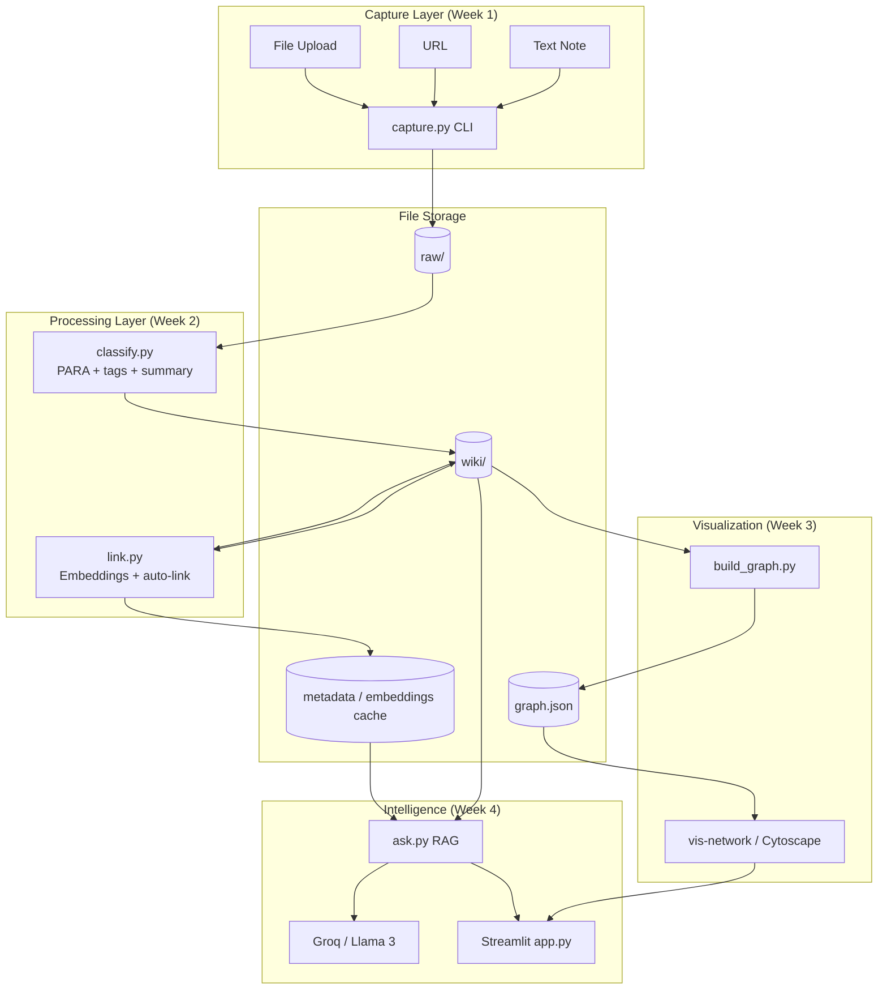
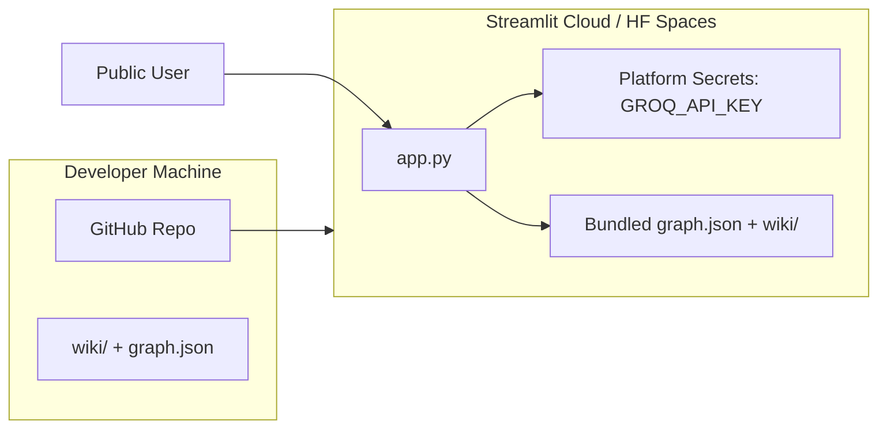

# SecondSelf — Detailed System Architecture

Architecture for **SecondSelf**, a personal AI second brain: capture → classify → link → visualize → query → deploy.

---

## 1. Executive Summary

SecondSelf is a **local-first, file-based knowledge system** with four layers:

| Layer | Role | Week |
|-------|------|------|
| **Ingestion** | Capture anything into `raw/` | 1 |
| **Organization** | PARA classify + embedding-based auto-link into `wiki/` | 2 |
| **Visualization** | Notes → graph JSON → interactive force-directed UI | 3 |
| **Intelligence + Delivery** | RAG Q&A + Streamlit app on a public URL | 4 |

Design principles:

- **Files as source of truth** — no DB required for MVP; markdown + JSON on disk
- **Pipeline-oriented** — each week adds a script/module; later weeks compose earlier ones
- **AI at the edges** — LLM for classification and synthesis; embeddings for similarity
- **Incremental build** — each milestone is shippable on real data

---

## 2. High-Level Architecture



---

## 3. Repository Structure

```
secondself/
├── raw/                          # Immutable captures (Week 1)
│   └── {timestamp}_{uuid}.{ext}  # e.g. 20260722_143022_a1b2c3d4.md
├── wiki/                         # Organized, linked notes (Week 2+)
│   ├── Projects/
│   ├── Areas/
│   ├── Resources/
│   └── Archives/
├── data/                         # Derived artifacts (optional but recommended)
│   ├── embeddings/               # Cached vectors per note ID
│   ├── graph.json                # Nodes + edges export
│   └── index.json                # Master index: id → path, category, tags
├── assets/                       # Copied/stored binary files from captures
│   └── files/
├── capture.py                    # Week 1
├── classify.py                   # Week 2.1
├── link.py                       # Week 2.2
├── build_graph.py                # Week 3.1
├── ask.py                        # Week 4.1
├── app.py                        # Week 4.2 — Streamlit shell
├── config.py                     # Shared config (paths, thresholds, API keys)
├── utils/
│   ├── ids.py                    # UUID + timestamp helpers
│   ├── markdown.py               # Frontmatter read/write
│   └── embeddings_store.py       # Load/save embedding cache
├── requirements.txt
├── .env.example                  # GROQ_API_KEY, etc.
├── README.md
├── PROBLEM_STATEMENT.md
├── architecture.md
├── implementation-plan.md
└── edge-case.md
```

---

## 4. Core Data Models

### 4.1 Raw Capture (`raw/`)

Every capture is a **self-describing file** with YAML frontmatter + body.

```yaml
---
id: "a1b2c3d4-e5f6-7890-abcd-ef1234567890"
captured_at: "2026-07-22T14:30:22+05:30"
type: "note" | "link" | "file"
source: "cli" | "streamlit"
original_filename: "report.pdf"   # files only
url: "https://..."                  # links only
mime_type: "application/pdf"        # files only
status: "unprocessed" | "processed"
---
# Raw content here (note text, fetched link summary, or extracted file text)
```

**Naming:** `{YYYYMMDD_HHMMSS}_{short_id}.{md|txt|pdf}`  
**Rule:** Raw files are **append-only**; processing never deletes them.

### 4.2 Wiki Note (`wiki/`)

Processed notes use **PARA folders** + **wiki-style links**.

```yaml
---
id: "a1b2c3d4-..."
raw_id: "a1b2c3d4-..."
created_at: "..."
updated_at: "..."
category: "Projects" | "Areas" | "Resources" | "Archives"
tags: ["python", "career"]
summary: "One-line summary from LLM"
links: ["other-note-id-1", "other-note-id-2"]
embedding_version: "sentence-transformers/all-MiniLM-L6-v2"
---
# Title (from summary or first line)

Note body (cleaned, possibly enriched).

Related: [[other-note-title]]
```

**Path:** `wiki/{PARA_category}/{slug-from-summary-or-id}.md`

### 4.3 Graph Model (`graph.json`)

```json
{
  "meta": {
    "generated_at": "ISO8601",
    "node_count": 42,
    "edge_count": 87
  },
  "nodes": [
    {
      "id": "note-uuid",
      "label": "One-line summary",
      "category": "Resources",
      "tags": ["ai", "notes"],
      "path": "wiki/Resources/....md",
      "preview": "First 200 chars..."
    }
  ],
  "edges": [
    {
      "source": "uuid-a",
      "target": "uuid-b",
      "weight": 0.82,
      "type": "semantic" | "explicit"
    }
  ]
}
```

### 4.4 Embedding Cache (`data/embeddings/`)

```json
{
  "note_id": "uuid",
  "model": "all-MiniLM-L6-v2",
  "vector": [0.12, -0.34, ...],
  "text_hash": "sha256-of-content"
}
```

---

## 5. Component Architecture (Module-by-Module)

### 5.1 `capture.py` — The Archivist (Week 1)

**Purpose:** One command to capture note, link, or file into `raw/`.

**Interface:**

```bash
python capture.py note "My idea about RAG pipelines"
python capture.py link "https://example.com/article"
python capture.py file "./documents/report.pdf"
```

**Internal flow:**

```
Parse CLI args
  → Generate UUID + timestamp
  → Detect type (note/link/file)
  → For links: optional HTTP fetch + title/snippet (Week 1: store URL + placeholder text)
  → For files: copy to assets/files/, extract text if PDF/txt
  → Write raw/{timestamp}_{id}.md with frontmatter + content
  → Print capture ID + path
```

**Dependencies:** `uuid`, `datetime`, `pathlib`, `argparse`, optional `requests`, `pypdf`/`pdfplumber`

**Outputs:** Files in `raw/`, optionally binaries in `assets/files/`

---

### 5.2 `classify.py` — The Sorting Hat (Week 2.1)

**Purpose:** Raw capture → PARA category, tags, summary → wiki note.

**Interface:**

```bash
python classify.py                    # process all unprocessed raw/
python classify.py --id {capture_id}  # single item
```

**Internal flow:**

```
Scan raw/ for status=unprocessed
  → Read content + metadata
  → Call Groq API (Llama 3) with structured prompt
  → Parse JSON response: { category, tags, summary }
  → Write wiki/{category}/{slug}.md
  → Update raw/ status=processed
  → Append to data/index.json
```

**LLM prompt contract (structured output):**

```
Given this capture, return JSON:
- category: one of Projects|Areas|Resources|Archives (PARA)
- tags: 3-5 lowercase tags
- summary: one sentence, max 120 chars
```

**Dependencies:** `groq` SDK, `config.GROQ_API_KEY`

---

### 5.3 `link.py` — Connect the Dots (Week 2.2)

**Purpose:** Embedding similarity → auto-link related wiki notes.

**Interface:**

```bash
python link.py                  # link all notes missing embeddings or new captures
python link.py --threshold 0.75
```

**Internal flow:**

```
For each wiki note:
  → Compute embedding (sentence-transformers, local)
  → Cache in data/embeddings/{id}.json

For each new/updated note:
  → Cosine similarity vs all other notes
  → If similarity >= threshold (default 0.72):
      → Add bidirectional link in frontmatter.links
      → Insert [[wiki-link]] in markdown body
  → Regenerate affected notes only
```

**Similarity strategy:**

| Stage | Method |
|-------|--------|
| MVP | Full pairwise cosine on MiniLM embeddings |
| Scale-up | FAISS / numpy matrix batch (optional later) |

**Threshold guidance:** Start at **0.72**; tune on your real notes (too low = noise, too high = missed links).

---

### 5.4 `build_graph.py` — The Cartographer (Week 3.1)

**Purpose:** Wiki notes + links → `graph.json`.

**Internal flow:**

```
Walk wiki/**/*.md
  → Parse frontmatter (id, category, tags, summary, links)
  → Create node per note
  → Create edges from:
      a) frontmatter.links (explicit)
      b) [[wiki-link]] parsing (explicit)
      c) optional: re-read embedding pairs above threshold (semantic)
  → Export graph.json
```

**Edge types:**

- `explicit` — manual or auto-inserted wiki links
- `semantic` — embedding similarity (optional second edge layer)

---

### 5.5 Interactive Graph (Week 3.2)

**Options:**

| Library | Pros | Cons |
|---------|------|------|
| **vis-network** | Easy Streamlit embed, force physics | Heavier bundle |
| **Cytoscape.js** | Rich styling | More setup |

**Recommended:** vis-network inside Streamlit via `streamlit-components` or `st.components.v1.html`.

**UI behaviors:**

- Force-directed layout (physics on)
- Node color by PARA category
- Hover tooltip: summary + preview
- Click node → side panel with full note
- Drag, zoom, pan

**Data path:** `graph.json` → injected into HTML/JS component

---

### 5.6 `ask.py` — The Oracle (Week 4.1)

**Purpose:** RAG Q&A over your wiki.

**Interface:**

```python
def ask(question: str, top_k: int = 5) -> dict:
    """
    Returns:
    {
      "answer": "...",
      "sources": [{"id", "summary", "path", "score"}],
      "confidence": "high|medium|low"
    }
    """
```

**RAG pipeline:**

```
User question
  → Embed question (same model as link.py)
  → Retrieve top-k wiki notes by cosine similarity
  → Build context block (summaries + relevant chunks)
  → Groq LLM: "Answer ONLY from context; cite note IDs"
  → Return synthesized answer + source list
```

**Guardrails:**

- System prompt: no hallucination outside retrieved notes
- If no note scores above min threshold → "I don't have enough in your notes to answer"
- Include source IDs in response for transparency

---

### 5.7 `app.py` — Streamlit Shell (Week 4.2)

**Layout:**

```
┌─────────────────────────────────────────────┐
│  SecondSelf — Your Personal AI Second Brain │
├──────────────────┬──────────────────────────┤
│  Ask anything    │  [Search bar] [Ask btn]  │
│                  │  Answer + sources          │
├──────────────────┴──────────────────────────┤
│  Living Brain Graph (interactive)           │
│  [vis-network canvas]                       │
├─────────────────────────────────────────────┤
│  Capture (optional sidebar)                 │
│  [note] [link] [file upload]                │
└─────────────────────────────────────────────┘
```

**App responsibilities:**

- Load `graph.json` and render graph
- Wire `ask()` to search bar
- Optional: trigger classify/link pipeline on new captures
- Sidebar: stats (note count, categories, last capture)

---

## 6. End-to-End Data Flow

```mermaid
sequenceDiagram
    participant User
    participant Capture
    participant Raw
    participant Classify
    participant Link
    participant Wiki
    participant Graph
    participant Ask
    participant LLM

    User->>Capture: note / link / file
    Capture->>Raw: write timestamped capture
    User->>Classify: run pipeline
    Classify->>LLM: PARA + tags + summary
    LLM-->>Classify: structured JSON
    Classify->>Wiki: create organized note
    User->>Link: run linker
    Link->>Wiki: update links
    User->>Graph: build_graph.py
    Graph->>Wiki: read all notes
    Graph-->>User: graph.json + UI
    User->>Ask: natural language question
    Ask->>Wiki: retrieve top-k notes
    Ask->>LLM: synthesize answer
    LLM-->>User: answer + sources
```

---

## 7. Technology Stack

| Concern | Choice | Rationale |
|---------|--------|-----------|
| Language | Python 3.10+ | Course spec, rich AI ecosystem |
| Capture CLI | `argparse` | Simple, no extra deps |
| LLM | Groq + Llama 3 | Free tier, fast |
| Embeddings | `sentence-transformers` (all-MiniLM-L6-v2) | Local, free, good enough |
| Similarity | `numpy` cosine | Lightweight MVP |
| Notes format | Markdown + YAML frontmatter | Human-readable, git-friendly |
| Graph UI | vis-network | Streamlit-friendly |
| Web app | Streamlit | Rapid full-stack UI |
| Deploy | Streamlit Cloud or HF Spaces | Free public URL |
| Secrets | `.env` + `python-dotenv` | Never commit API keys |
| PDF text | `pypdf` or `pdfplumber` | File capture support |

**`requirements.txt` (baseline):**

```
streamlit
groq
sentence-transformers
numpy
python-dotenv
pyyaml
requests
pypdf
```

---

## 8. Configuration (`config.py`)

Centralize paths and tunables:

```python
RAW_DIR = "raw"
WIKI_DIR = "wiki"
DATA_DIR = "data"
GRAPH_PATH = "data/graph.json"
EMBEDDINGS_DIR = "data/embeddings"

SIMILARITY_THRESHOLD = 0.72
RAG_TOP_K = 5
RAG_MIN_SCORE = 0.45
EMBEDDING_MODEL = "sentence-transformers/all-MiniLM-L6-v2"
LLM_MODEL = "llama3-8b-8192"  # Groq model id
```

---

## 9. PARA Classification Logic

| PARA | Meaning | Examples |
|------|---------|----------|
| **Projects** | Active outcomes with deadline | "Build SecondSelf", "Job application Q3" |
| **Areas** | Ongoing responsibilities | Health, finances, career growth |
| **Resources** | Reference material | Articles, tutorials, bookmarks |
| **Archives** | Inactive/completed | Old project notes, past events |

LLM returns one primary category; wiki folder structure mirrors PARA.

---

## 10. Deployment Architecture



**Deployment notes:**

- Commit `wiki/`, `graph.json`, and sample captures (no private data unless intended)
- Set `GROQ_API_KEY` in platform secrets
- `sentence-transformers` adds size — use HF Spaces if build times out on Streamlit Cloud
- For live capture in production: write to ephemeral storage or re-run pipeline on deploy

**MVP deploy strategy:** Pre-build graph + embeddings locally; ship static artifacts with the app.

---

## 11. Security & Privacy

- Raw captures may contain **PII** — use `.gitignore` for sensitive `raw/` if needed
- API keys only via environment variables
- Public deploy: scrub or anonymize personal notes before pushing
- Link fetching: timeout + size limits to avoid SSRF/abuse
- File uploads: validate extensions and max size

---

## 12. Observability & Testing (Lightweight)

| Check | How |
|-------|-----|
| Capture works | 10+ real items in `raw/` |
| Classify works | PARA folders populated |
| Links work | Notes contain `[[...]]` cross-refs |
| Graph works | `graph.json` node/edge counts match wiki |
| RAG works | Ask questions only answerable from your notes |
| E2E | capture → classify → link → build_graph → ask |

**Suggested smoke test script:** `scripts/smoke_test.py` runs pipeline on one fixture note.

---

## 13. Week-to-Architecture Mapping

| Week | Badge | Modules | Artifact |
|------|-------|---------|----------|
| 1 | The Archivist | `capture.py`, `raw/`, `wiki/` scaffold | 10+ raw captures |
| 2 | The Librarian | `classify.py`, `link.py` | 15+ organized wiki notes |
| 3 | The Cartographer | `build_graph.py`, graph UI | Interactive force graph |
| 4 | The Oracle | `ask.py`, `app.py`, deploy | Public URL + RAG |

---

## 14. Extension Points (Post-MVP)

- SQLite/Chroma for embedding index at scale
- Scheduled background worker for auto-processing new raw captures
- Browser extension for one-click link capture
- Obsidian-compatible wiki export
- Multi-user auth (out of scope for 4-week MVP)

---

## 15. Architecture Decision Records (ADRs)

| Decision | Choice | Alternatives rejected |
|----------|--------|----------------------|
| Storage | File-based markdown | PostgreSQL — overkill for MVP |
| Embeddings | Local sentence-transformers | OpenAI embeddings — cost |
| LLM | Groq free tier | OpenAI — cost for learning project |
| UI | Streamlit | FastAPI + React — slower to ship |
| Graph format | JSON export | Live DB graph — unnecessary coupling |
