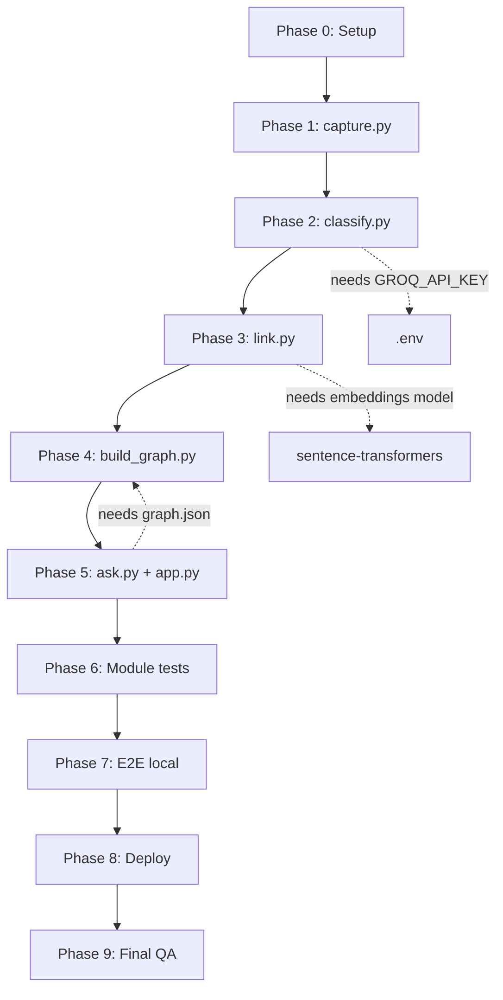

# SecondSelf — Phase-Wise Implementation Plan

This plan implements the system described in [architecture.md](./architecture.md) and the goals in [PROBLEM_STATEMENT.md](./PROBLEM_STATEMENT.md).

**Build philosophy:** Each phase ships something testable on **real data**. Week outputs become the next week's inputs.

---

## Overview

| Phase | Focus | Week / Badge | Key Deliverable |
|-------|-------|--------------|-----------------|
| **0** | Setup | — | Repo scaffold, config, shared utils |
| **1** | Capture pipeline | Week 1 — The Archivist | `capture.py` + 10+ raw items |
| **2** | Auto-classify | Week 2 — The Librarian (2.1) | `classify.py` + PARA wiki notes |
| **3** | Auto-link | Week 2 — The Librarian (2.2) | `link.py` + linked wiki |
| **4** | Graph build + UI | Week 3 — The Cartographer | `build_graph.py` + interactive graph |
| **5** | RAG + Streamlit | Week 4 — The Oracle | `ask.py` + `app.py` |
| **6** | Module testing | — | Per-module smoke tests pass |
| **7** | E2E local testing | — | Full pipeline verified locally |
| **8** | Deploy | — | Live public URL |
| **9** | Final validation | — | README, GitHub, deployed E2E check |

```mermaid
flowchart LR
    P0[Phase 0 Setup] --> P1[Phase 1 Capture]
    P1 --> P2[Phase 2 Classify]
    P2 --> P3[Phase 3 Link]
    P3 --> P4[Phase 4 Graph]
    P4 --> P5[Phase 5 Ask + App]
    P5 --> P6[Phase 6 Module Tests]
    P6 --> P7[Phase 7 E2E Tests]
    P7 --> P8[Phase 8 Deploy]
    P8 --> P9[Phase 9 Final QA]
```



---

## Phase 0 — Project Setup

**Goal:** Create the foundation every later phase depends on.

### Tasks

1. **Initialize repository structure**

   ```
   raw/
   wiki/Projects/
   wiki/Areas/
   wiki/Resources/
   wiki/Archives/
   data/embeddings/
   assets/files/
   utils/
   scripts/
   ```

2. **Create `requirements.txt`**

   ```
   streamlit
   groq
   sentence-transformers
   numpy
   python-dotenv
   pyyaml
   requests
   pypdf
   ```

3. **Create `config.py`**

   - Define all paths: `RAW_DIR`, `WIKI_DIR`, `DATA_DIR`, `GRAPH_PATH`, `EMBEDDINGS_DIR`
   - Define tunables: `SIMILARITY_THRESHOLD`, `RAG_TOP_K`, `RAG_MIN_SCORE`, `EMBEDDING_MODEL`, `LLM_MODEL`
   - Load `GROQ_API_KEY` from environment via `python-dotenv`

4. **Create shared utilities**

   | File | Responsibility |
   |------|----------------|
   | `utils/ids.py` | `generate_id()`, `timestamp_now()`, filename slug helper |
   | `utils/markdown.py` | Read/write YAML frontmatter, parse wiki notes |
   | `utils/embeddings_store.py` | Save/load embedding JSON cache (stub OK for Phase 0) |

5. **Create project docs**

   - `PROBLEM_STATEMENT.md` — problem, goals, weekly milestones
   - `.env.example` — `GROQ_API_KEY=your_key_here`
   - `.gitignore` — `.env`, `__pycache__/`, `.venv/`, optional `raw/` if sensitive

6. **Set up Python environment**

   ```bash
   python -m venv .venv
   .venv\Scripts\activate        # Windows
   pip install -r requirements.txt
   cp .env.example .env          # add Groq API key
   ```

### Acceptance Criteria

- [ ] All folders exist (`raw/`, `wiki/` with PARA subfolders, `data/`, `assets/`)
- [ ] `config.py` loads without errors
- [ ] `requirements.txt` installs cleanly in a fresh venv
- [ ] `.env.example` documents required secrets
- [ ] `PROBLEM_STATEMENT.md` present in repo root

### Estimated effort

~1–2 hours

---

## Phase 1 — Capture Pipeline (Week 1: The Archivist)

**Goal:** One command captures any note, link, or file into `raw/` with timestamp + unique ID.

**Maps to:** `capture.py` (architecture §5.1)

### Tasks

1. **Implement `capture.py` CLI**

   ```bash
   python capture.py note "Your note text here"
   python capture.py link "https://example.com/article"
   python capture.py file "./path/to/document.pdf"
   ```

2. **Implement capture logic**

   - Generate UUID + ISO timestamp on every capture
   - Write file to `raw/{YYYYMMDD_HHMMSS}_{short_id}.md`
   - YAML frontmatter: `id`, `captured_at`, `type`, `source`, `status: unprocessed`
   - Type-specific fields:
     - **note:** body = user text
     - **link:** store `url`; optionally fetch page title via `requests` (with timeout)
     - **file:** copy binary to `assets/files/`; extract text from PDF/txt via `pypdf`

3. **Add `.gitkeep` files** in empty dirs so Git tracks folder structure

4. **Capture 10+ real items** — your own scattered notes, bookmarks, and files (not dummy data)

### Acceptance Criteria

- [ ] `raw/` and `wiki/` folder structure exists
- [ ] One command captures a note, a link, AND a file
- [ ] Every capture has a timestamp + unique ID in frontmatter
- [ ] 10+ real items in `raw/`
- [ ] Raw files are never overwritten (append-only)

### Test checklist

```bash
python capture.py note "Meeting notes from project kickoff"
python capture.py link "https://docs.python.org/3/"
python capture.py file "./some-real-file.pdf"
# Verify: ls raw/ shows 3+ files, each with id + captured_at in frontmatter
```

### Badge

🏅 **The Archivist**

### Estimated effort

~2–4 hours

---

## Phase 2 — Auto-Classify (Week 2.1: The Sorting Hat)

**Goal:** Send raw captures to Groq/Llama 3; get PARA category, tags, and summary; write organized wiki notes.

**Maps to:** `classify.py` (architecture §5.2)

### Prerequisites

- Phase 1 complete (10+ items in `raw/`)
- Valid `GROQ_API_KEY` in `.env`

### Tasks

1. **Implement `classify.py`**

   ```bash
   python classify.py              # process all unprocessed raw/
   python classify.py --id {uuid}  # single capture
   ```

2. **LLM integration**

   - Prompt Groq (Llama 3) with capture content
   - Request structured JSON: `{ "category", "tags", "summary" }`
   - Validate category is one of: `Projects`, `Areas`, `Resources`, `Archives`
   - Handle malformed JSON with retry or fallback

3. **Wiki note creation**

   - Write `wiki/{category}/{slug}.md` with full frontmatter (see architecture §4.2)
   - Copy/transform raw body into wiki note body
   - Mark raw capture `status: processed`
   - Append entry to `data/index.json`

4. **Run on all Phase 1 captures** — confirm notes land in correct PARA folders

### Acceptance Criteria

- [ ] Any raw capture → category + tags + summary automatically
- [ ] PARA categorization working (4 folders populated)
- [ ] Raw status updated to `processed`
- [ ] `data/index.json` tracks all wiki notes

### Test checklist

```bash
python classify.py
# Verify: wiki/Projects|Areas|Resources|Archives/ contain .md files
# Verify: each note has category, tags, summary in frontmatter
# Verify: raw/ files show status: processed
```

### Estimated effort

~3–5 hours

---

## Phase 3 — Auto-Link (Week 2.2: Connect the Dots)

**Goal:** Compute embeddings per wiki note; auto-link related notes above similarity threshold.

**Maps to:** `link.py` (architecture §5.3)

### Prerequisites

- Phase 2 complete (15+ wiki notes recommended)

### Tasks

1. **Implement `utils/embeddings_store.py`**

   - Save/load `{ note_id, model, vector, text_hash }` to `data/embeddings/{id}.json`
   - Skip re-computation if `text_hash` unchanged

2. **Implement `link.py`**

   ```bash
   python link.py
   python link.py --threshold 0.72
   ```

3. **Embedding pipeline**

   - Load `sentence-transformers/all-MiniLM-L6-v2` (first run downloads model)
   - Embed each wiki note (summary + body)
   - Cache vectors in `data/embeddings/`

4. **Similarity + linking**

   - Pairwise cosine similarity (numpy)
   - If score ≥ `SIMILARITY_THRESHOLD` (default 0.72):
     - Add note IDs to both notes' `links` frontmatter
     - Insert `[[related-note-slug]]` in markdown body (bidirectional)
   - Avoid duplicate links on re-runs

5. **Run on 15+ real items** — inspect auto-generated connections make sense

### Acceptance Criteria

- [ ] Embeddings computed per note
- [ ] Related notes auto-linked (no manual tagging)
- [ ] Runs on 15+ real items → organized, linked `wiki/`
- [ ] Re-running `link.py` is idempotent (no duplicate links)

### Test checklist

```bash
python link.py
# Verify: data/embeddings/ has one JSON per note
# Verify: related notes contain [[wiki-links]] and links in frontmatter
# Spot-check: two notes on same topic are linked
```

### Badge

🏅 **The Librarian**

### Estimated effort

~4–6 hours

---

## Phase 4 — Graph Build + Interactive UI (Week 3: The Cartographer)

**Goal:** Convert linked wiki into `graph.json`; render force-directed interactive graph with hover, drag, and zoom.

**Maps to:** `build_graph.py` + graph UI (architecture §5.4, §5.5)

### Prerequisites

- Phase 3 complete (linked wiki with 15+ notes)

### Tasks

#### 4.1 — Graph data model

1. **Implement `build_graph.py`**

   ```bash
   python build_graph.py
   ```

2. **Graph builder logic**

   - Walk `wiki/**/*.md`
   - Create one node per note: `id`, `label`, `category`, `tags`, `path`, `preview`
   - Create edges from:
     - `frontmatter.links` (explicit)
     - `[[wiki-link]]` parsing (explicit)
   - Export to `data/graph.json` with `meta` block (counts, timestamp)

#### 4.2 — Interactive graph

3. **Create graph HTML component** (e.g. `components/graph_view.py` or inline in `app.py`)

   - Load `graph.json`
   - Render with **vis-network** via `st.components.v1.html`
   - Force-directed physics enabled
   - Node colors by PARA category
   - Hover tooltip: summary + preview text
   - Drag, zoom, pan

4. **Standalone test page** (optional): open graph HTML in browser before Streamlit integration

### Acceptance Criteria

- [ ] Script builds nodes + edges from notes and exports clean JSON
- [ ] Interactive force-directed graph renders from that JSON
- [ ] Hover reveals note content
- [ ] Drag + zoom work
- [ ] Built from your real notes, not dummy data

### Test checklist

```bash
python build_graph.py
# Verify: data/graph.json has node_count == number of wiki notes
# Verify: edges match visible [[links]] in markdown
# Open graph in browser / temp Streamlit page — hover, drag, zoom
```

### Badge

🏅 **The Cartographer**

### Estimated effort

~4–6 hours

---

## Phase 5 — RAG Q&A + Streamlit App (Week 4: The Oracle)

**Goal:** `ask()` function for retrieval-augmented Q&A; single Streamlit app combining graph + search.

**Maps to:** `ask.py` + `app.py` (architecture §5.6, §5.7)

### Prerequisites

- Phase 4 complete (`graph.json` exists, graph UI works)
- Groq API key configured

### Tasks

#### 5.1 — Natural language search

1. **Implement `ask.py`**

   ```python
   from ask import ask
   result = ask("What did I note about RAG pipelines?")
   # result: { "answer", "sources", "confidence" }
   ```

2. **RAG pipeline**

   - Embed question (same model as `link.py`)
   - Retrieve top-k notes by cosine similarity (`RAG_TOP_K = 5`)
   - Reject if best score < `RAG_MIN_SCORE` (0.45)
   - Send retrieved context + question to Groq
   - System prompt: answer ONLY from context; cite source note IDs
   - Return answer + source list + confidence level

#### 5.2 — Streamlit UI

3. **Implement `app.py`**

   - **Header:** "SecondSelf — Your Personal AI Second Brain"
   - **Search section:** text input + Ask button → calls `ask()`
   - **Answer panel:** synthesized answer + linked sources
   - **Graph section:** embed vis-network component from Phase 4
   - **Sidebar (optional):** note stats, capture form (note/link/file upload)
   - **Pipeline hook (optional):** button to run classify → link → build_graph

4. **Local Streamlit run**

   ```bash
   streamlit run app.py
   ```

### Acceptance Criteria

- [ ] `ask()` returns answers synthesized from your own notes (retrieval + LLM)
- [ ] Answers include source references
- [ ] Low-confidence / no-match cases handled gracefully
- [ ] One Streamlit app contains both the graph and the search bar

### Test checklist

```bash
streamlit run app.py
# Ask 3 questions you know the answer to from your notes
# Ask 1 question NOT in your notes — should refuse or say insufficient context
# Confirm graph and search both work in same app
```

### Badge

🏅 **The Oracle**

### Estimated effort

~5–8 hours

---

## Phase 6 — Local Module Testing

**Goal:** Verify each module independently before full pipeline testing.

### Tasks

1. **Create `scripts/smoke_test.py`** — runs quick checks per module

2. **Module test matrix**

   | Module | Test | Expected |
   |--------|------|----------|
   | `capture.py` | Capture note, link, file | 3 new files in `raw/` with valid frontmatter |
   | `classify.py` | Classify one unprocessed raw | Wiki note created; raw marked processed |
   | `link.py` | Run on 2+ related notes | Embeddings cached; link inserted |
   | `build_graph.py` | Rebuild graph | JSON valid; counts match wiki |
   | `ask.py` | Ask known question | Answer cites correct sources |
   | `app.py` | `streamlit run app.py` | App loads without traceback |

3. **Fix any failures** before Phase 7

### Acceptance Criteria

- [ ] Each module passes its smoke test
- [ ] No unhandled exceptions in happy-path runs
- [ ] Config paths resolve correctly on Windows (project uses `\` paths via `pathlib`)

### Estimated effort

~2–3 hours

---

## Phase 7 — End-to-End Local Testing

**Goal:** Run the full pipeline on real data and confirm every stage connects.

### Tasks

1. **Full pipeline run**

   ```bash
   # 1. Capture new real item
   python capture.py note "Final E2E test note about machine learning"

   # 2. Classify
   python classify.py

   # 3. Link
   python link.py

   # 4. Build graph
   python build_graph.py

   # 5. Ask
   python -c "from ask import ask; print(ask('What do I know about machine learning?'))"

   # 6. UI
   streamlit run app.py
   ```

2. **E2E verification checklist**

   - [ ] New capture appears in `raw/`
   - [ ] Classify creates wiki note in correct PARA folder
   - [ ] Link adds relationships to existing notes (if similar)
   - [ ] Graph updates with new node + edges
   - [ ] Ask returns answer grounded in your notes
   - [ ] Streamlit shows updated graph and working search

3. **Data quality review**

   - Review PARA assignments — fix prompt if systematically wrong
   - Tune `SIMILARITY_THRESHOLD` if too many/few links
   - Tune `RAG_MIN_SCORE` if ask() returns irrelevant sources

### Acceptance Criteria

- [ ] End-to-end flow verified: capture → classify → link → graph → ask
- [ ] All 4 weekly milestone artifacts present (raw, wiki, graph, app)
- [ ] Tested on real personal data, not fixtures

### Estimated effort

~2–4 hours

---

## Phase 8 — Deploy to Public URL

**Goal:** Ship SecondSelf live on Streamlit Cloud or Hugging Face Spaces.

**Maps to:** architecture §10

### Tasks

1. **Prepare repo for deployment**

   - Write `README.md`: project description, setup, usage, live URL
   - Scrub or anonymize sensitive notes before committing
   - Ensure `app.py` is the Streamlit entry point
   - Pre-build `data/graph.json` and `data/embeddings/` locally (MVP strategy)
   - Add `packages.txt` or pin versions if deploy platform requires it

2. **Choose platform**

   | Platform | When to use |
   |----------|-------------|
   | **Streamlit Cloud** | Default; connect GitHub repo, set main file `app.py` |
   | **HF Spaces** | Fallback if `sentence-transformers` causes slow/failed builds |

3. **Configure secrets**

   - Set `GROQ_API_KEY` in platform secrets (never in repo)

4. **Deploy**

   - Push to GitHub
   - Connect repo to Streamlit Cloud (or create HF Space)
   - Set entry point: `app.py`
   - Wait for build; fix dependency errors if any

5. **Post-deploy smoke test**

   - Open public URL
   - Confirm graph renders
   - Ask one test question
   - Check browser console for JS errors

### Acceptance Criteria

- [ ] Public GitHub repo with clean README + setup instructions
- [ ] Deployed live with a public URL
- [ ] Graph loads on deployed app
- [ ] Ask/search works on deployed app

### Estimated effort

~2–4 hours

---

## Phase 9 — Final Validation & Ship

**Goal:** Confirm the complete product meets all project deliverables.

### Tasks

1. **Final deliverables checklist**

   - [ ] Public GitHub repo
   - [ ] Live deployed URL — interactive graph + ask-your-brain search
   - [ ] End-to-end flow works in deployed environment
   - [ ] All 4 weekly badges earned:
     - 🏅 The Archivist (capture)
     - 🏅 The Librarian (classify + link)
     - 🏅 The Cartographer (graph)
     - 🏅 The Oracle (ask + deploy)

2. **README finalization**

   - Problem statement (1 paragraph)
   - Architecture diagram or link to `architecture.md`
   - Setup instructions (venv, `.env`, pip install)
   - Usage examples (capture, classify, link, graph, ask)
   - Live demo URL
   - Screenshots of graph + Q&A (optional but recommended)

3. **Deployed E2E test** (repeat Phase 7 checklist on live URL)

4. **Create `edge-case.md`** — document corner cases discovered during testing (see separate prompt)

### Acceptance Criteria

- [ ] Full pipeline works end to end in the deployed app
- [ ] README is complete and accurate
- [ ] No API keys committed to GitHub
- [ ] Public URL shareable and stable

### Estimated effort

~1–2 hours

---

## Implementation Order Summary

```
Phase 0  →  Scaffold repo, config, utils, venv
Phase 1  →  capture.py + 10+ real captures
Phase 2  →  classify.py + PARA wiki notes
Phase 3  →  link.py + embeddings + auto-links
Phase 4  →  build_graph.py + vis-network UI
Phase 5  →  ask.py + app.py (Streamlit)
Phase 6  →  Per-module smoke tests
Phase 7  →  Full local E2E pipeline test
Phase 8  →  Deploy to Streamlit Cloud / HF Spaces
Phase 9  →  Final QA, README, GitHub, live E2E
```

---

## Dependencies Between Phases



**Do not skip phases.** Each phase produces artifacts the next phase consumes.

---

## Risk Mitigation

| Risk | Mitigation |
|------|------------|
| Groq rate limits | Batch classify with delays; cache results |
| Slow first embedding run | Pre-download model in Phase 3 setup |
| Too many auto-links | Raise `SIMILARITY_THRESHOLD` to 0.75–0.80 |
| Too few auto-links | Lower threshold to 0.65–0.70 |
| Streamlit deploy timeout | Pre-build embeddings/graph; use HF Spaces |
| Hallucinated answers | Strict RAG prompt + `RAG_MIN_SCORE` gate |
| Sensitive data in public repo | `.gitignore` raw/; ship anonymized wiki only |

---

## Total Estimated Timeline

| Phase | Hours |
|-------|-------|
| 0 — Setup | 1–2 |
| 1 — Capture | 2–4 |
| 2 — Classify | 3–5 |
| 3 — Link | 4–6 |
| 4 — Graph | 4–6 |
| 5 — Ask + App | 5–8 |
| 6 — Module tests | 2–3 |
| 7 — E2E local | 2–4 |
| 8 — Deploy | 2–4 |
| 9 — Final QA | 1–2 |
| **Total** | **~26–44 hours** |

Aligned with the 4-week course structure: ~1 week per major build phase (1–4), plus setup, testing, and deployment.
